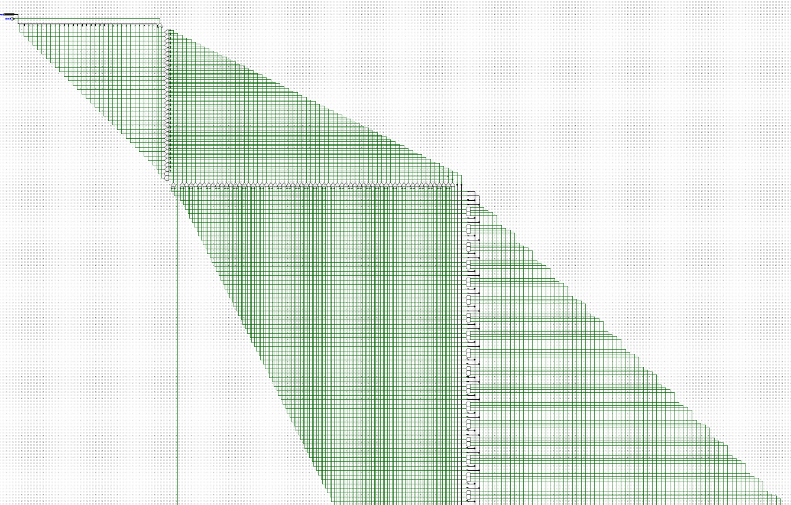

# snakeHDL: A simple, purely-functional HDL for Python

snakeHDL is a tool for creating logic circuits with a focus on simplicity and accessibility. The goal is not to compete with the industry heavyweights, but to give hackers, makers, and educators a fun and easy way to build hardware with a few lines of Python.


*Part of a 32-bit full adder generated by a few lines of snakeHDL*

## Introduction
snakeHDL compiles trees of primitive binary operations into logic circuits with named inputs and outputs:

```
  $ pip install snakehdl
  $ python3
  >>> from snakehdl import *
  >>> from snakehdl.components.arithmetic import adderN
  >>> BITS = 32
  >>> result, carry = adderN(BITS, input_bits('a', BITS), input_bits('b', BITS), input_bits('cin', 1))
  >>> out = output(result=result, cout=carry)
```
BOps are naturally composable into larger circuits because they are lazily evaluated. When you create a tree of BOps, nothing actually happens until you compile it:

```
  >>> from snakehdl.compiler import LogisimCompiler
  >>> LogisimCompiler().compile(out).save('adder32.circ')
```

We can build composite logical structures like adders, multiplexers,
and even full ALUs starting from these fundamental BOps. Bit widths throughout
the tree are automatically inferred from input widths at compile time.

snakeHDL abstracts hardware-specific concerns away into the compiler backends,
leaving you to focus on implementing the pure logic of your circuit.

Since only twelve primitive BOps are specified by snakeHDL, it is straightforward to
create compiler backends for new target platforms.

Wanna use this to implement a Python bytecode interpreter on an FPGA and then make [Snakeware 2](https://github.com/joshiemoore/snakeware) without Linux? Let's build the SNAKE PROCESSOR!!!

## Compiler Targets
- [x] Python - compile your circuit to a pickled Python function that accepts your named inputs
    as kwargs and returns the result as a dict of your named outputs. Useful for automated logic testing.
- [x] Logisim Evolution 3.9.0 .circ files
- [ ] Verilog
- [ ] Arduino
- [ ] OpenCL kernels
- [ ] FPGAs+ASICs
- [ ] Minecraft Redstone
- [ ] ...

## Binary Operations (BOps)
The following binary operations are specified by the snakeHDL API and must be implemented in hardware (or simulated hardware) by the compiler backends:

### I/O Operations
* CONST - `const_bits(val: np.uint | int, bits: int=1) -> BOp`
* INPUT - `input_bits(name: str, bits: int=1) -> BOp`
* OUTPUT - `output(**kwargs: BOp) -> BOp`
* BIT - `bit(src: BOp, index: int) -> BOp`
* JOIN - `join(*args: BOp) -> BOp`

At compile time, the root of the tree must be an OUTPUT node, and this node's named outputs
will be your circuit's outputs. Any INPUT nodes will be treated as your circuit's
named inputs.

The `BIT` operation is used to select one bit from an n-bit signal.

The `JOIN` operation is used to combine n 1-bit signals into one n-bit signal.

### Combinational Operations
* NOT - `neg(a: BOp) -> BOp`
* AND - `conj(a: BOp, b: BOp) -> BOp`
* NAND - `nand(a: BOp, b: BOp) -> BOp`
* OR - `disj(a: BOp, b: BOp) -> BOp`
* NOR - `nor(a: BOp, b: BOp) -> BOp`
* XOR - `xor(a: BOp, b: BOp) -> BOp`
* XNOR - `xnor(a: BOp, b: BOp) -> BOp`

...and that's it! See `examples/` for demonstrations of these operations. Sequential logic is not supported by snakeHDL, but sequential elements could be considered for a future expansion.
